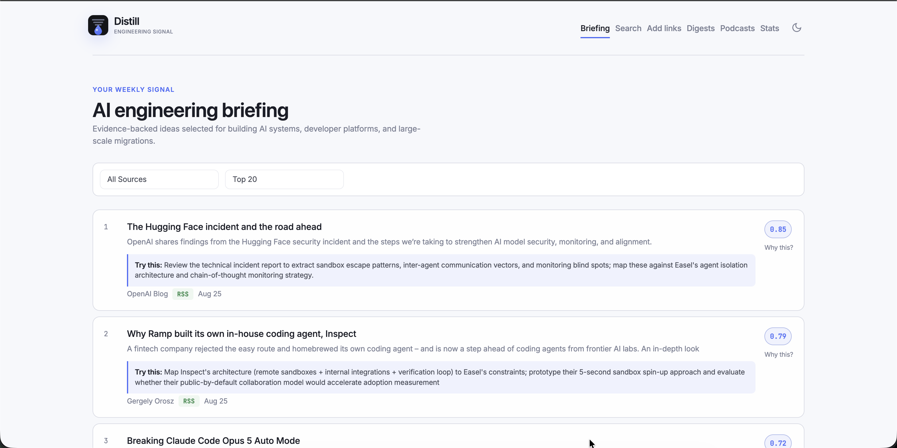

# Distill

AI article curation and podcast generator for senior engineers focused on AI adoption — coding agents, agentic workflows, LLM integration, and practical AI engineering.

Aggregates articles from multiple sources, extracts content, deduplicates, scores with Claude as an LLM judge, generates weekly digests, and produces two-host AI podcasts — all browsable through a local web dashboard.



## How It Works

```
Collect → Extract → Deduplicate → Score → Digest → Podcast
   │         │          │            │        │         │
   │         │          │            │        │         └─ NotebookLM (default) or Claude script + edge-tts → MP3
   │         │          │            │        └─ Ranked markdown summary of top N articles
   │         │          │            └─ Engagement Z-score + Claude LLM judge (depth/novelty/applicability)
   │         │          └─ Title similarity (difflib) + embedding cosine (sentence-transformers)
   │         └─ trafilatura + readability-lxml fallback
   └─ HackerNews, RSS, Dev.to, arXiv, Slack (async, parallel)
```

## Quick Start

### Prerequisites

- Python 3.12+
- [uv](https://docs.astral.sh/uv/) package manager
- `ANTHROPIC_API_KEY` environment variable (for scoring and podcast generation)

### Install & Run

```bash
# Clone and install
git clone <repo-url> && cd distill
uv sync

# Set up environment
cp .env.example .env  # Add your ANTHROPIC_API_KEY

# Initialize database
uv run distill init

# Run the full pipeline (collect → extract → dedup → score → truncate)
uv run distill run

# Start the web dashboard
uv run distill serve
# → http://localhost:8585
```

## CLI Reference

```bash
distill init [--install-launchd]    # Create DB schema, optionally install macOS schedulers
distill collect [--source SOURCE]   # Fetch articles from enabled sources
distill extract [--limit N]         # Extract full content (default: 50 articles)
distill dedup [--embeddings]        # Mark duplicates (title similarity, optional embeddings)
distill score                       # Score articles (engagement + Claude LLM)
distill run                         # Full pipeline: collect → extract → dedup → score → truncate
distill digest [--week LABEL] [--top N]  # Generate markdown digest (default: current week, top 20)
distill podcast [--articles IDS]    # Generate podcast (weekly or on-demand by article IDs)
distill archive                     # Weekly job: digest + podcast + prune old articles
distill serve                       # Start web dashboard on localhost:8585
distill ingest FILE [--db PATH]     # Ingest articles from a JSON file (used with Slack MCP backend)
distill stats                       # Print database statistics
distill qa [--port PORT]            # Visual QA screenshots (requires rodney + showboat)
```

All commands accept `--config PATH` to override the default `config.yaml`.

## Architecture

### Sources (Collectors)

| Source | API | Default | Notes |
|--------|-----|---------|-------|
| HackerNews | Algolia Search | Enabled | 30+ AI keywords, min 10 points |
| RSS | Atom/RSS feeds | Enabled | 15 curated feeds (Simon Willison, Karpathy, Anthropic, OpenAI, etc.) |
| Dev.to | Public API | Disabled | Tag-based (ai, llm, generativeai) |
| arXiv | Atom Feed | Disabled | Categories: cs.AI, cs.LG, cs.CL, cs.SE |
| Slack | slack-sdk / MCP | Disabled | Link-sharing channels; two backends (see below) |

All collectors are async and run in parallel. Each implements a common `Collector` protocol, making it straightforward to add new sources.

#### Slack Backend

Slack has two interchangeable backends configured via `sources.slack.backend`:

- **`token`** (autonomous) — uses `slack-sdk` with a user token (`xoxp-*`) to fetch channel history directly. Runs automatically as part of `distill collect`.
- **`mcp`** (Claude-mediated) — no bot token required. `distill collect` skips Slack; you manually ask Claude to read the channels and pipe the results into the DB:
  1. Ask Claude: *"Read the last 100 messages from #engineering and give me a JSON list of messages with external URLs and at least 2 reactions."*
  2. Claude calls the Slack MCP tool, parses results, and formats them as `CollectedArticle` JSON.
  3. Claude runs: `distill ingest /tmp/slack-articles.json`

The `channels`, `min_reactions`, and `max_results` config values guide Claude in MCP mode even though collection is manual.

### Claude Skill (`distill-pipeline`)

Distill ships a packaged Claude Code skill at `.claude/skills/distill-pipeline/SKILL.md` that automates the full pipeline — including Slack MCP collection — from a single prompt.

**Trigger phrases:** "run the distill pipeline", "collect articles", "generate a digest", "run distill"

**What it does:**

1. Reads `config.yaml` to determine Slack backend and channel config
2. Dispatches a subagent (to protect the main context window from large pipeline output)
3. If `backend: mcp` — the subagent reads Slack channels via MCP, filters by `min_reactions`, deduplicates URLs across channels, writes `/tmp/distill-slack-articles.json`, and runs `distill ingest`
4. Runs `distill run && distill digest` and reports the digest path + article counts

**When each path is used:**

| `slack` config | What happens |
|---|---|
| `enabled: false` | Slack skipped; pipeline runs normally |
| `enabled: true`, `backend: token` | `distill run` fetches Slack autonomously |
| `enabled: true`, `backend: mcp` | Skill drives MCP collection then runs the pipeline |

To use the skill, just ask Claude: *"Run the distill pipeline"* from this project directory.

### Scoring System

Articles are scored on a 0–1 composite scale with configurable weights:

| Component | Weight | Method |
|-----------|--------|--------|
| Engagement | 0.15 | Z-score normalization of points + comments |
| Technical Depth | 0.20 | Claude LLM rating (rewrites → deep dives) |
| Novelty | 0.25 | Claude LLM rating (obvious → fresh perspective) |
| Applicability | 0.40 | Claude LLM rating (theoretical → actionable Monday morning) |

Articles without sufficient engagement or content get engagement-only scores, capped at 0.4. Manually added articles (via the web dashboard or `/add`) automatically receive the highest score (1.0) so they always appear at the top.

### Deduplication

Two-pass strategy:

1. **Title similarity** — `difflib.SequenceMatcher`, threshold 0.85
2. **Embedding cosine similarity** — `all-MiniLM-L6-v2` via sentence-transformers, threshold 0.88

Duplicates are linked to a canonical article (lowest ID) via a `dedup_groups` table. URL normalization strips tracking parameters (`utm_*`, `ref`, `fbclid`, etc.) before insertion.

### Podcast Generation

Configurable via `podcast.provider` in `config.yaml`:

| Provider | Default | How it works | Requirements |
|----------|---------|-------------|--------------|
| `notebooklm` | Yes | Uploads source doc to Google NotebookLM, generates audio via their pipeline | `notebooklm-py` (see disclaimer below) |
| `edge-tts` | No | Claude generates a two-host script (Alex & Sarah), edge-tts synthesizes audio | `ANTHROPIC_API_KEY` |

**Shared steps (both providers):**
1. Top N articles collected (weekly or on-demand selection)
2. Full content re-fetched on-demand (up to 3000 chars per article)
3. Manually added articles tagged `[MUST COVER]` to guarantee inclusion

**edge-tts flow:** Claude script → parse into speaker segments → edge-tts renders each segment → concatenate into MP3.

**NotebookLM flow:** Build source markdown → upload to NotebookLM notebook → generate audio → download MP3.

### Web Dashboard

FastAPI app with Jinja2 templates and Pico CSS:

- **Articles** — browsable list with composite scores, source badges, score breakdowns
- **Article detail** — full metadata, score reasoning from Claude
- **Search** — HackerNews Algolia + Dev.to search, add results directly to DB
- **Add links** — bulk URL submission with automatic content extraction
- **Digests** — weekly markdown summaries
- **Podcasts** — audio player, on-demand generation via HTMX
- **Stats** — total articles, by-source breakdown, scoring coverage
- **Theme toggle** — light/dark mode with localStorage persistence

## Configuration

Everything is customizable via `config.yaml`. The defaults are tuned for AI/engineering topics, but you can point Distill at any domain by changing the keywords, feeds, and scoring weights.

**Make it yours:**
- **Track a different topic** — swap `hackernews.keywords` and `rss.feeds` to follow security, DevOps, frontend, or any niche
- **Tune article quality** — adjust `scoring.weights` to prioritize novelty over applicability, or vice versa
- **Switch podcast provider** — set `podcast.provider` to `notebooklm` or `edge-tts`
- **Change podcast voices** — pick any [edge-tts voice](https://github.com/rany2/edge-tts) for host A/B (edge-tts provider only)
- **Enable more sources** — flip `devto`, `arxiv`, or `slack` to `enabled: true`
- **Adjust dedup sensitivity** — lower thresholds catch more duplicates, higher lets more through

```yaml
database:
  path: distill.db

sources:
  hackernews:
    enabled: true
    keywords: [AI coding, Claude Code, agentic engineering, ...]
    min_points: 10
    max_results: 50
  rss:
    enabled: true
    feeds:
      - url: https://simonwillison.net/atom/entries/
        name: Simon Willison
      # ... 14 more feeds
  devto:
    enabled: false
  arxiv:
    enabled: false
  slack:
    enabled: false
    backend: mcp            # "mcp" (Claude-mediated) or "token" (autonomous, requires token)
    # token: "${SLACK_USER_TOKEN}"   # uncomment for token backend (xoxp-* user token)
    channels:
      - id: "C0123456789"   # right-click channel in Slack → Copy link → last path segment
        name: "engineering"
    min_reactions: 2        # minimum emoji reactions to include a link
    max_results: 30

scoring:
  model: claude-sonnet-4-5-20250929
  weights: { engagement: 0.15, technical_depth: 0.20, novelty: 0.25, applicability: 0.40 }

dedup:
  title_similarity_threshold: 0.85
  embedding_similarity_threshold: 0.88
  embedding_model: all-MiniLM-L6-v2

podcast:
  provider: notebooklm  # notebooklm (default) or edge-tts (free, no key)
  voice_a: en-US-GuyNeural  # edge-tts only
  voice_b: en-US-AriaNeural  # edge-tts only
  top_n: 20

web:
  host: 0.0.0.0
  port: 8585
```

## Environment Variables

| Variable | Required | Purpose |
|----------|----------|---------|
| `ANTHROPIC_API_KEY` | Yes (for scoring + podcasts) | Claude API for LLM scoring and podcast scripts |

## Database

SQLite with WAL mode. Four tables:

- **articles** — collected articles with content, metadata, engagement metrics, dedup flags
- **scores** — composite + per-axis scores with Claude's reasoning
- **dedup_groups** — canonical/duplicate relationships with similarity method
- **digests** — weekly markdown digests with podcast file paths

URL normalization (tracking param stripping, www removal) is applied at insertion for accurate deduplication.

## Automation (macOS)

```bash
uv run distill init --install-launchd
```

Installs two launchd agents in `~/Library/LaunchAgents/`:

| Schedule | Command | Purpose |
|----------|---------|---------|
| Daily 8:00 AM | `distill run` | Collect, extract, dedup, score |
| Sunday 10:00 AM | `distill archive` | Generate digest + podcast, prune old articles |

Logs written to `output/daily.log` and `output/podcast.log`.

## Project Structure

```
distill/
├── src/distill/
│   ├── cli.py              # Typer CLI commands
│   ├── config.py           # YAML config + env var loading
│   ├── models.py           # Pydantic models (Article, Score, Source enum)
│   ├── db.py               # SQLite wrapper, schema, CRUD
│   ├── collectors/
│   │   ├── base.py         # Collector protocol
│   │   ├── hackernews.py   # HN Algolia API
│   │   ├── rss.py          # Feedparser-based RSS/Atom
│   │   ├── devto.py        # Dev.to public API
│   │   ├── arxiv.py        # arXiv Atom feed
│   │   └── slack.py        # Slack (token backend via slack-sdk, or MCP-mediated)
│   ├── processing/
│   │   ├── extractor.py    # Content extraction (trafilatura + readability)
│   │   ├── dedup.py        # Title + embedding deduplication
│   │   └── scorer.py       # Engagement + Claude LLM scoring
│   ├── outputs/
│   │   ├── digest.py       # Markdown digest generation
│   │   ├── podcast.py      # Script generation + TTS + MP3
│   │   └── web.py          # FastAPI dashboard
│   └── templates/          # Jinja2 HTML templates (8 files)
├── tests/                  # pytest suite (db, dedup, scoring, digest, web, collectors)
├── launchd/                # macOS plist files for scheduled automation
├── output/                 # Generated digests, podcasts, logs
├── config.yaml             # Main configuration
├── pyproject.toml          # Project metadata + dependencies
└── uv.lock                 # Dependency lock file
```

## Development

```bash
# Install dev dependencies
uv sync --group dev

# Run tests
uv run pytest

# Lint
uv run ruff check src/ tests/
uv run ruff format src/ tests/
```

## Tech Stack

| Layer | Technology |
|-------|-----------|
| Language | Python 3.12+ |
| Package manager | uv |
| CLI | Typer + Rich |
| Web | FastAPI + Jinja2 + Pico CSS + HTMX |
| Database | SQLite (WAL mode) |
| HTTP | httpx (async) |
| Content extraction | trafilatura + readability-lxml |
| Embeddings | sentence-transformers (all-MiniLM-L6-v2) |
| LLM | Anthropic Claude (scoring + podcast scripts) |
| TTS | NotebookLM (default) or edge-tts (Microsoft neural voices) |
| RSS | feedparser |
| Scheduling | macOS launchd |
| Testing | pytest + pytest-asyncio |
| Linting | Ruff |

## Disclaimer

**This project is provided "as is" for personal/educational use only, without warranty of any kind.**

- **NotebookLM integration:** The `notebooklm-py` library is a third-party, reverse-engineered client for Google NotebookLM. It is **not** an official Google API and may violate Google's Terms of Service. Use it at your own risk. Google may change or restrict access at any time without notice. If this is a concern, switch to the `edge-tts` provider which uses only free, legitimate APIs.
- **Content & copyright:** Distill fetches and excerpts content from third-party websites, RSS feeds, and APIs. The extracted content remains the property of its original authors and publishers. This tool is intended for personal curation and summarization. Do not redistribute extracted content in ways that infringe on copyright.
- **Generated podcasts:** Podcast audio is generated using either Google NotebookLM or Microsoft Edge TTS voices. The generated audio is for personal use. Redistribution or commercial use may be subject to the respective service's terms.
- **API usage:** This tool makes calls to the Anthropic API (for scoring and script generation) and various public APIs (HackerNews Algolia, Dev.to, arXiv). You are responsible for your own API usage, costs, and compliance with each provider's terms.

**The authors of this project accept no liability for any consequences arising from the use of this software, including but not limited to Terms of Service violations, copyright claims, API costs, or data loss.**
